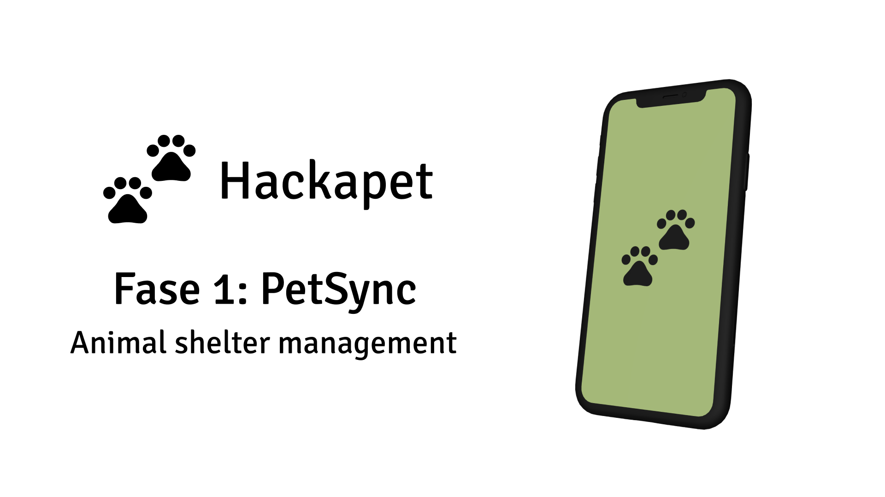

# PetSync iOS
[English](README.md) | [Español](README.es.md)



Fase 3 del proyecto Hackapet iOS utilizando Kotlin Multiplatform Mobile (KMM).

## Índice
1. [Propósito del Proyecto](#propósito-del-proyecto)
2. [Configuración del Entorno](#configuración-del-entorno)
   - [Dispositivo Mac](#dispositivo-mac)
   - [Git](#git)
   - [Cuenta de GitHub](#cuenta-de-github)
   - [Xcode](#xcode)
   - [Android Studio](#android-studio)
3. [Instrucciones de Instalación](#instrucciones-de-instalación)
   - [Git](#instalar-git)
   - [Xcode](#instalar-xcode)
   - [Android Studio](#instalar-android-studio)
4. [Verificación](#verificación)
5. [Recursos Adicionales](#recursos-adicionales)

## Propósito del Proyecto
PetSync iOS es la Fase 3 del proyecto Hackapet para dispositivos iOS, utilizando Kotlin Multiplatform Mobile (KMM) para el desarrollo multiplataforma. Esta aplicación tiene como objetivo optimizar la gestión de refugios de animales mediante un sistema eficiente de mantenimiento de registros que agiliza las operaciones diarias.

Características principales:
- Seguimiento de animales en el refugio
- Inventario de suministros
- Generación de informes
- Compatibilidad multiplataforma con Android

## Configuración del Entorno
### Dispositivo Mac
Necesitas un dispositivo Mac para desarrollar aplicaciones iOS. Asegúrate de que tu Mac cumpla con los [requisitos del sistema para Xcode](https://developer.apple.com/support/xcode/).

### Git
Git es esencial para el control de versiones. Permite realizar un seguimiento de los cambios en el código, colaborar con otros y gestionar los repositorios de código.

### Cuenta de GitHub
Necesitarás una cuenta en GitHub para colaborar en el proyecto y acceder a los repositorios.

### Xcode
Xcode es el entorno de desarrollo integrado (IDE) para el desarrollo de iOS.

### Android Studio
Android Studio es necesario para la parte KMM del proyecto y para ejecutar la versión Android de la aplicación.

## Instrucciones de Instalación

### Instalar Git
1. Abre Terminal y verifica si Git está instalado:
   ```
   git --version
   ```
2. Si no está instalado, instala Homebrew (si no lo tienes):
   ```
   /bin/bash -c "$(curl -fsSL https://raw.githubusercontent.com/Homebrew/install/HEAD/install.sh)"
   ```
3. Luego instala Git:
   ```
   brew install git
   ```
4. Configura Git:
   ```
   git config --global user.name "Tu Nombre"
   git config --global user.email "tu_email@ejemplo.com"
   ```

### Instalar Xcode
1. Ve a la [Mac App Store](https://apps.apple.com/us/app/xcode/id497799835?mt=12) y descarga Xcode.
2. Instala las Herramientas de Línea de Comandos de Xcode:
   ```
   xcode-select --install
   ```
3. Abre Xcode y acepta el acuerdo de licencia.

### Instalar Android Studio
1. Descarga Android Studio desde la [página oficial](https://developer.android.com/studio).
2. Instala Android Studio moviéndolo a tu carpeta de Aplicaciones.
3. Abre Android Studio y sigue el asistente de configuración.
4. En Android Studio, ve a Preferencias > Appearance & Behavior > System Settings > Android SDK e instala los SDK necesarios.
5. Configura el Administrador de AVD (Dispositivo Virtual Android) para crear emuladores de Android.

## Verificación
Después de la instalación, verifica que todo funcione correctamente:

1. Comprueba la instalación de Git:
   ```
   git --version
   ```
2. Verifica el acceso a GitHub:
   ```
   git clone git@github.com:nombredeusuario/repositorio.git
   ```
3. Prueba Xcode:
   Crea un nuevo proyecto de iOS y ejecútalo en un simulador.
4. Prueba Android Studio:
   Crea un nuevo proyecto de Android y ejecútalo en un emulador.

## Recursos Adicionales
- [Wiki del Proyecto](https://github.com/hackapet-project/petsync-ios/wiki)
- [Documentación para Desarrolladores de iOS](https://developer.apple.com/documentation/)
- [Documentación para Desarrolladores de Android](https://developer.android.com/docs)
- [Documentación de Kotlin Multiplatform Mobile](https://kotlinlang.org/docs/mobile/home.html)
- [Documentación de Git](https://git-scm.com/doc)

Para más información o si encuentras algún problema, consulta nuestra [wiki](https://github.com/hackapet-project/petsync-ios/wiki) o abre un issue en el repositorio.
