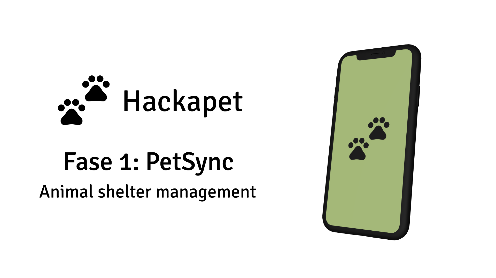

# PetSync iOS
[English](README.md) | [Español](README.es.md)



Phase 3 of the Hackapet iOS project using Kotlin Multiplatform Mobile (KMM).

## Table of Contents
1. [Project Purpose](#project-purpose)
2. [Environment Setup](#environment-setup)
   - [Mac Device](#mac-device)
   - [Git](#git)
   - [GitHub Account](#github-account)
   - [Xcode](#xcode)
   - [Android Studio](#android-studio)
3. [Installation Instructions](#installation-instructions)
   - [Git](#install-git)
   - [Xcode](#install-xcode)
   - [Android Studio](#install-android-studio)
4. [Verification](#verification)
5. [Additional Resources](#additional-resources)

## Project Purpose
PetSync iOS is Phase 3 of the Hackapet project for iOS devices, utilizing Kotlin Multiplatform Mobile (KMM) for cross-platform development. This application aims to optimize animal shelter management through an efficient record-keeping system that streamlines daily operations.

Key features:
- Tracking of animals in the shelter
- Supply inventory
- Report generation
- Cross-platform compatibility with Android

## Environment Setup
### Mac Device
You need a Mac device to develop iOS applications. Ensure your Mac meets the [system requirements for Xcode](https://developer.apple.com/support/xcode/).

### Git
Git is essential for version control. It allows you to track changes in your code, collaborate with others, and manage your code repositories.

### GitHub Account
You'll need an account on GitHub to collaborate on the project and access repositories.

### Xcode
Xcode is the integrated development environment (IDE) for iOS development.

### Android Studio
Android Studio is required for the KMM part of the project and for running the Android version of the app.

## Installation Instructions

### Install Git
1. Open Terminal and check if Git is installed:
   ```
   git --version
   ```
2. If not installed, install Homebrew (if you don't have it):
   ```
   /bin/bash -c "$(curl -fsSL https://raw.githubusercontent.com/Homebrew/install/HEAD/install.sh)"
   ```
3. Then install Git:
   ```
   brew install git
   ```
4. Configure Git:
   ```
   git config --global user.name "Your Name"
   git config --global user.email "your_email@example.com"
   ```

### Install Xcode
1. Go to the [Mac App Store](https://apps.apple.com/us/app/xcode/id497799835?mt=12) and download Xcode.
2. Install Xcode Command Line Tools:
   ```
   xcode-select --install
   ```
3. Open Xcode and agree to the license agreement.

### Install Android Studio
1. Download Android Studio from the [official page](https://developer.android.com/studio).
2. Install Android Studio by moving it to your Applications folder.
3. Open Android Studio and follow the setup wizard.
4. In Android Studio, go to Preferences > Appearance & Behavior > System Settings > Android SDK and install the required SDKs.
5. Configure the AVD (Android Virtual Device) Manager to create Android emulators.

## Verification
After installation, verify that everything is working correctly:

1. Check Git installation:
   ```
   git --version
   ```
2. Verify GitHub access:
   ```
   git clone git@github.com:username/repository.git
   ```
3. Test Xcode:
   Create a new iOS project and run it on a simulator.
4. Test Android Studio:
   Create a new Android project and run it on an emulator.

## Additional Resources
- [Project Wiki](https://github.com/hackapet-project/petsync-ios/wiki)
- [iOS Developer Documentation](https://developer.apple.com/documentation/)
- [Android Developer Documentation](https://developer.android.com/docs)
- [Kotlin Multiplatform Mobile Documentation](https://kotlinlang.org/docs/mobile/home.html)
- [Git Documentation](https://git-scm.com/doc)

For more information or if you encounter any issues, please refer to our [wiki](https://github.com/hackapet-project/petsync-ios/wiki) or open an issue in the repository.
